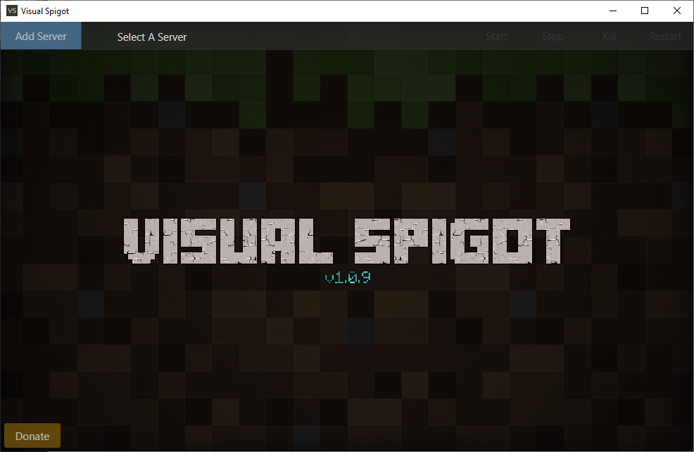
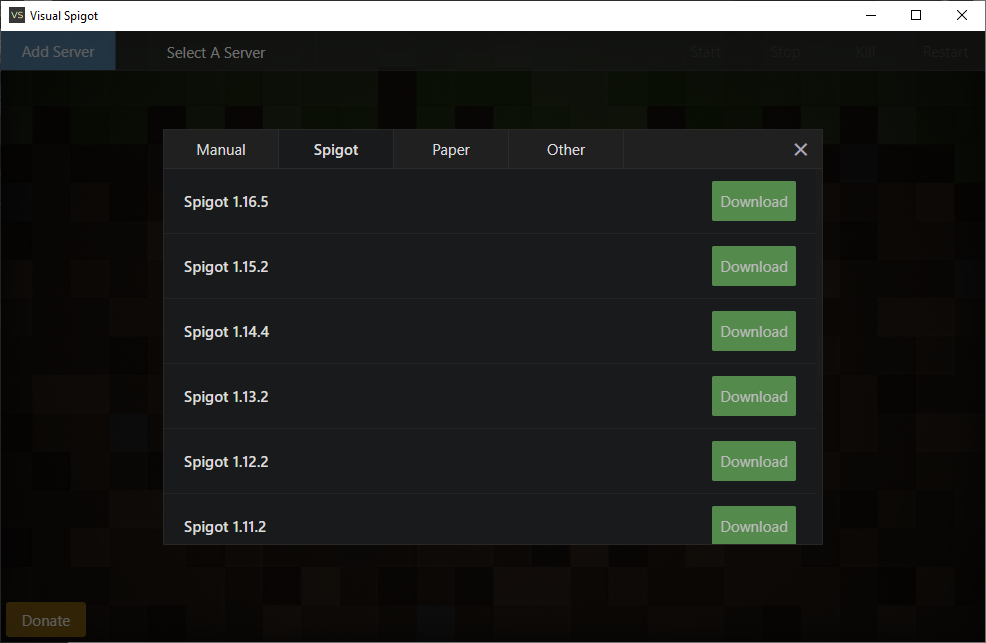
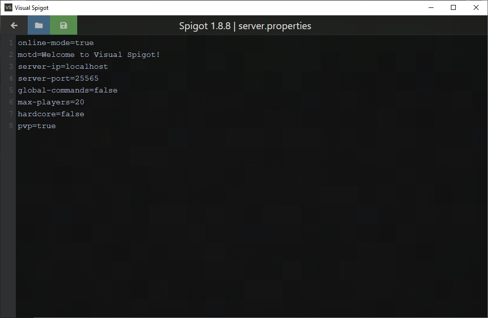
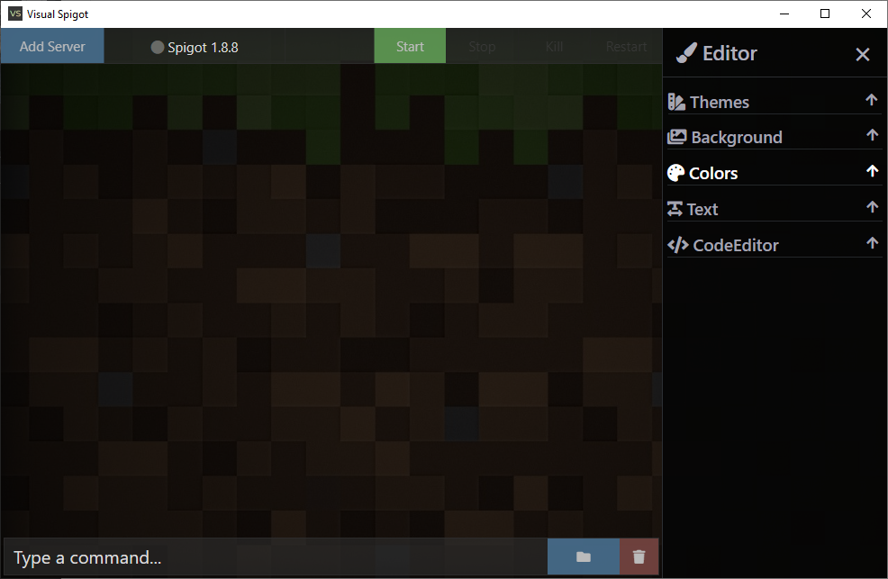

<!-- ABOUT THE PROJECT -->
## About The Project

If you are new to Minecraft plugin development or a seasoned developer you will find this application very useful. 
VisualSpigot comes with a unique and beautifully designed interface for starting local Minecraft servers. 
You can have as many servers as you want and access each of them within the same window. Message me on discord 
if there are any bugs or if you need assistance LostDeception#8132.

### Built With

* [ElectronJS](https://www.electronjs.org/)
* [Javascript](https://www.w3schools.com/js)
* [HTML, CSS](https://www.w3schools.com/html)
* [Bootstrap](https://getbootstrap.com)
* [Jquery](https://jquery.com)

## Download Link

https://www.spigotmc.org/resources/visual-spigot.87912/
